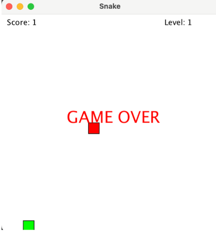
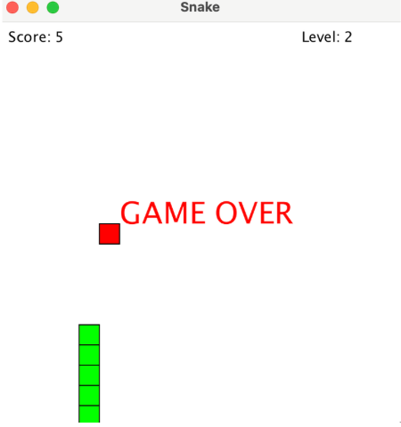
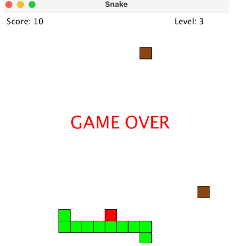

# Snake Game Project

## Overview

This repository contains a Java implementation of a Snake Game developed as a final project for COMP 127. The game was built using object-oriented programming principles and the Kilt Graphics library provided in class.

The player controls a snake using the arrow keys. The goal is to collect food to increase the score and level up while avoiding collisions with walls and obstacles. As the player progresses, the game speed increases and additional obstacles are added to increase the difficulty.

Main features of the project include:
- Snake movement using keyboard controls
- Random food spawning
- Score tracking system
- Multiple game levels
- Dynamic obstacle generation
- Collision detection
- Game over and win conditions
- Object-oriented class structure

---

## Required Software

The following software must be installed to run this project:

- OpenJDK 21 or later
- Visual Studio Code (VSCode)
- Java Extension Pack for VSCode
- Kilt Graphics library used in COMP 127

Example versions:
- openjdk version "21"
- VSCode version 1.99 or later

---

## How to Run the Project

1. Clone or download this GitHub repository.

2. Open the project folder in VSCode.

3. Make sure the Java Extension Pack is installed.

4. Make sure the Kilt Graphics library is properly added to the project.

5. Open the `SnakeGame.java` file.

6. Run the `main` method inside `SnakeGame.java`.

7. A game window titled "Snake" should appear.

---

## Controls

- Up Arrow → Move Up
- Down Arrow → Move Down
- Left Arrow → Move Left
- Right Arrow → Move Right

---

## Expected Output

When the program runs:

- A 400x400 game window appears
- The snake starts in the center of the screen
- Red food blocks randomly appear
- The score and level are displayed on screen
- The snake grows when food is collected
- The game speed increases at higher levels
- Obstacles appear in Level 3
- The game ends if the snake hits a wall or obstacle
- The player wins after reaching a score of 15

### Example Screenshots

---

## Presentation Video

[Presentation Video]()

---

## Presentation Slides

[Presentation Slides](https://www.canva.com/design/DAHIqkViEgs/mlbIswAzhE5g0oMPIn-dwg/edit)

---

## Known Limitations

Current limitations and known issues include:

- The game does not currently support restarting after game over.
- There is no main menu or pause feature.
- The game only supports one player.

---

## Resources Referenced

The following resources were referenced during development:

- COMP 127 course materials 
- Kilt Graphics documentation
- VSCode Java documentation
- Java official documentation:
  https://docs.oracle.com/en/java/
- Stack Overflow discussions related to Java debugging and game logic

---

## Authors

Developed by:
- Aisling Li
- Zora Shi

COMP 127 Final Project